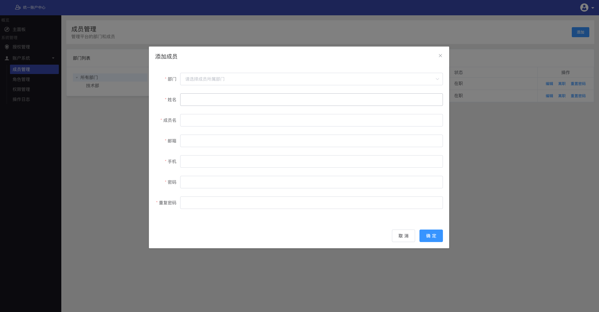
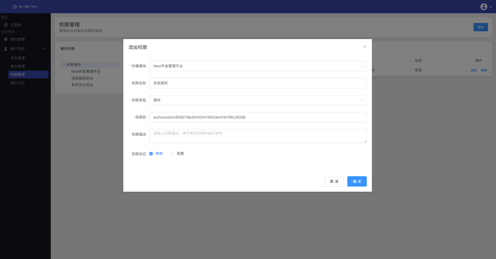

# 统一账户服务

统一账户中心用以统一管理组织内部系统，使用统一的权限管理、授权接入、支持账户与LDAP同步以接入第三方软件。

## 1. 特性
* 基于微服务架构；
* 基于 RBAC 模型的权限系统，最小颗粒度数据权限限制；
* 参考 OAuth2 实现授权机制，帮助其它组件快速、安全接入账户中心；
* 支持账户数据与 LDAP 保持同步，整合第三方软件账户管理；

## 2. 系统名称

### 2.1 客户端
客户端代表等待接入统一账户服务的系统。客户端通过 Client ID、Client Secret 来进行系统授权接入。在统一账户服务管理界面，可以配置与客户端绑定的权限模块和授权对象 IP 地址，对客户端进行接入控制。

### 2.2 部门

部门是用于分组管理成员的集合，由部门名称和父部门组成。

### 2.3 成员

成员是指使用统一账户服务，或使用接入了统一账户服务系统的人，通常我们理解为员工账号。在后台可以手动添加一个员工账号，如下所示：

### 2.4 权限模块

权限模块是用于分组管理权限的集合，由模块名称和父模块组成。用于配置客户端与权限模块绑定，和配置角色权限时的分组显示。

### 2.5 权限

权限是系统的核心，主要由所属模块、权限名称、权限类型、权限码等组成。

**权限分为 4 个类型：**

* 接口权限，用于接口的访问控制；
* 页面权限，用于前端页面访问控制；
* 组件权限，用于前端组件访问控制；
* 授权权限，用户系统访问授权控制，某成员拥有某系统的授权权限，才可以登录该系统。

**权限码：**

权限类型 | 格式 | 示例
:---|:---:|:---
接口权限 | http_method@uri?params | `get@accounts`、`get@accounts?status=1&type=1`
页面权限 | page@uri | `page@members`、`page@admin/members`
组件权限 | component@uri | `component@login-form`、`component@production-form`
收钱权限 | authorization@clientID | `authorization@5827dbd042004782b3e431b198c29268`

**添加权限示例：**

### 2.6 角色
角色是绑定权限的集合，拥有某角色的用户，便拥有该角色下的所有权限。

