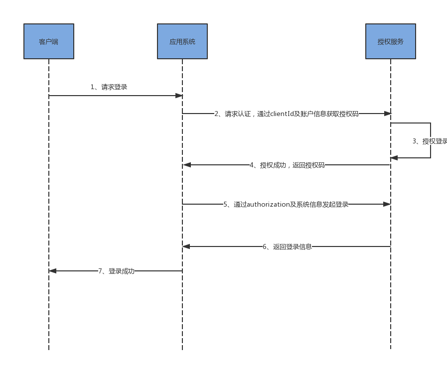

# 授权流程

应用系统授权登录的技术流程如下图所示：

下面对其进行详细介绍：

步骤1：应用系统获取授权码（authorizationCode）

授权码是应用系统获取授权的必备信息

获取方式：

授权页网址为https//localhost:8100/auth/login?clientId=e489c5a6da934fe2b441824809b50ae6

clientId是应用系统的id，由授权系统颁发

请求授权的URI：

> POST /auth/username/login

请求参数如下：

|参数|类型|是否必填|参数说明|
|:--:|:-:|:----:|:-----:|
|clientId|string|否|应用系统id，不填默认是授权系统|
|username|string|是|用户名|
|password|string|是|登录密码|

步骤2：通过授权码及系统的相关信息发起登录请求

这一步是真正意义上的登录。系统的相关信息包括系统的id、系统密钥以及当前登录的有效时间：

请求授权登录的URI：

> POST /code/login

请求参数如下：

|参数|类型|是否必填|参数说明|
|:--:|:-:|:----:|:-----:|
|code|string|是|授权码|
|clientId|string|是|应用系统id|
|secret|string|是|应用系统密钥|
|expired|long|是|当前登录有效时间（秒）|

登录成功后会返回登录用户的相关信息
